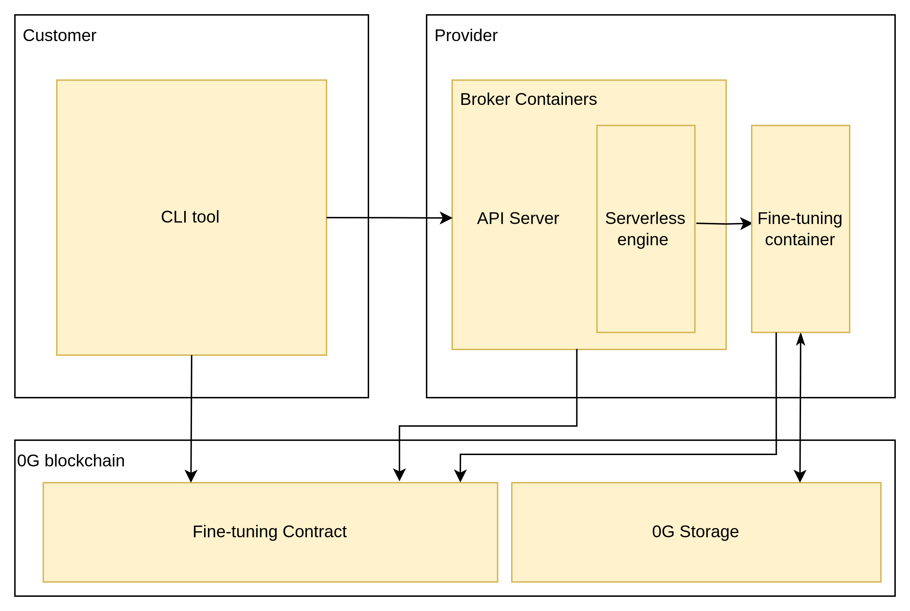

## Objectives

The 0G Compute Network supports integrated fine-tuning, aiming to:

1. Provide customers with reliable fine-tuning computational resources.
2. Ensure providers' profitability through stable settlement channels.

## Process

1. Providers start their servers in a CVM and publish their fine-tuning services on the 0G Compute Network, including quotas, prices, and other information. When a server starts, it generates a signing key pair. The `/quote` endpoint supports downloading the RA report so that customers can verify the server and get the signing public key (signing address).
2. **Service** **Verification**： Customers select an appropriate provider to use their `/quote` interface to download the RA report, verify it against the specified contract, and save the signing address included in the RA report.
3. **Key Generation and Account Creation**: Customers generate a key pair and use it along with a signing address from the RA report to create an account on the contract, pre-depositing funds.
4. **Task Creation Request**: Customers send a signed request to the provider to create a fine-tuning task. The signature confirms the fee, fine-tuning input file root hash, customer address, and nonce.
5. **Script Execution and Encryption**: The provider runs the script prepared by us and generates a TEE signature using the signing key, ensuring the following processes are executed correctly:
   - Verify the signature in the task request using the customer's public key and ensure consistency with the plain information.
   - Confirm the legality of the plain information, including:
     - Proper calculation of task fees.
     - Sufficiency of customer balance to cover the fees.
     - Nonce has not been reused (greater than the contract record).
   - Download and verify that the pre-trained model, dataset, and fine-tuning script from 0G Storage match the input root hash.
   - Execute the fine-tuning script and generate the model.
   - Internally generate a one-time secret.
   - Encrypt the model using the secret.
   - Encrypt the secret using the customer’s public key.
   - Upload the encrypted model to 0G Storage and obtain the model root hash.
   - Add the model root hash to the contract.
   - Generate a TEE signature of settlement metadata (model root hash, encrypted secret, task fee, customer address, and nonce) using the signing key.
6. **Customers download the encrypted model**:
   1. Customers download the encrypted model using the root hash obtained from the contract
   2. Customers ensure the downloaded file matches the root hash
   3. Customers call the contract `/acknowledge` function to acknowledge that the expected model with the given root hash has been downloaded.
7. **Settlement**: Provider uses the TEE signature, encrypted secret, model root hash, task fee, customer address, and nonce for settlement.
8. **Contract Settlement and Verification**:
   - Ensure the customer has acknowledged the fine-tuned model has been downloaded.
   - Validate the TEE signature to ensure fine-tuning was correctly executed and the information is accurate.
   - Store the model root hash and make payments in 0G tokens to the provider based on the information.
9. **Model Decryption and Retrieval**:
   - Customers download and decrypt the model using its private key.

_note_:

1. Providers cannot offer multiple fine-tuning tasks simultaneously.
2. Tasks are settled immediately upon completion.
3. The model, once uploaded to 0G Storage, should be downloaded by the customer within the specified retention period.
4. Providers can preset fine-tuning scripts and preTrainModel on 0G Storage and publicly share the root hash for customers to use directly.

## Architecture



_note_: The fine-tuning process is similar to inference but involves different internal logic, hence components and contracts are not reused.

## Contracts

Fine-tuning contracts are divided into serving.sol, account.sol, and service.sol:

1. **serving.sol**: Entry file containing external interface functions and settlement logic.
2. **account.sol**: Records user balances, nonces, public keys, and includes account operations.
3. **service.sol**: Records provider service information, including quotas, prices, and service operations.

### Key Variables and Functions

### Account

Records transaction information between the provider and the customer.

```solidity
struct Account {
    address user;    // User address
    address provider; // Provider address
    uint nonce;      // Nonce
    uint balance;    // Balance
    uint[2] signer;      // Customer's public key for signatures
    uint pendingRefund;   // Pending refund
    Refund[] refunds;    // Refund records
    Deliverable[] deliverables; // Deliverables records
}

struct Deliverable {
    uint jobID;
    uint modelRootHash;
}
```

_note_:

1. Refund logic is the same as inference.
2. Deliverable records are used for customer model downloads.

### Service

Records service information offered by the provider. `presetModels` represents preset models that the provider claims to offer.

```solidity
struct Service {
    address provider;
    string name;
    string url;
    Quota quota;
    ~~string[] presetModels;~~
}

struct Quota {
    uint cpu;
    uint nodeMemory;
    string gpuPrice;
}
```

### Fees

Fine-tuning fees are settled immediately after task completion. The fee factors include:

1. Size of the pre-trained model (???)
2. Dataset size
3. Number of epochs
4. GPU price ( price decided by provider )
5. Storage fees for 0G Storage (fixed)

```solidity
function calculateFee(string memory gpuType, uint epochs, uint preTrainModelSize, uint datasetSize) public view returns (uint);
```

### Settlement

Involves three key steps:

1. TEE validation.
2. Saving model data hash to the account.
3. Payment of fees to the provider.

```solidity
function settle(string memory teeSignature, uint modelRootHash, uint fee, uint nonce, uint customer);
```

## Customer

Provides a CLI tool for account creation, data upload, task creation, task progress query, and model download.

Interface:

```bash
Usage:
  0g-compute-client [command] [flags]

Available Commands:
  create-account Create a new account with specified provider and balance
  deposit-fund   Deposit funds into an account with specified provider and amount
  create-task    Create a new task for processing with specified parameters
  query-progress Query the progress of an ongoing task using provider address and job ID
  download-model Download the processed model file using provider address, job ID, and key

Common Flags:
      --gas-limit uint       Custom gas limit to send transaction
      --gas-price uint       Custom gas price to send transaction
  -h, --help                 help for 0g-compute-client

create-account Command:
  Usage:
    create-account [flags]

  Description:
    Create a new account with a specified provider address and initial balance.

  Flags:
    --key string                 Wallet private key of the customer
    --provider-address string    Address of the provider for the new account
    --balance uint               Initial balance to set for the new account

deposit-fund Command:
  Usage:
    deposit-fund [flags]

  Description:
    Deposit funds into an account with a specified provider address and amount.

  Flags:
    --key string                 Wallet private key of the customer
    --provider-address string    Address of the provider for depositing funds
    --amount uint                Amount of funds to be deposited

list-service Command:
  Usage:
    list-service [flags]

  Description:
    Display a list of available services from the provider.

  Flags:
    --filter string              Apply a filter to the list based on service type or other criteria

create-task Command:
  Usage:
    create-task [flags]

  Description:
    Create a new task for processing and receive a job ID.

  Flags:
    --key string                 Wallet private key of the customer
    --provider-address string    Address of the provider to use for processing
    --pretrained-model string    Root hash or local file path for the pre-trained model
    --dataset string             Root hash or local file path for the dataset
    --finetune-script string     Root hash or local file path for the fine-tuning script
    --cpu uint                   Expected CPU quota to be used
    --memory uint                Expected memory quota to be used (in MB)
    --gpu-type string            Type of GPU expected to be used (e.g., NVIDIA, AMD)
    --epochs uint                Number of epochs for training

  Note:
    - If a local file path is provided for the pre-trained model, dataset, or fine-tuning script,
      the CLI will automatically upload the file and use the root hash for task creation.
    - Outputs a job ID for the created task.

query-progress Command:
  Usage:
    query-progress [flags]

  Description:
    Query the progress of an ongoing task using the provider address and job ID.

  Flags:
    --provider-address string     Address of the service provider
    --job-id string               The job ID returned by create-task

download-model Command:
  Usage:
    download-model [flags]

  Description:
    Download the processed model file using the specified provider address, job ID, and customer private key.

    This command will:
      1. Retrieve the model's root hash from the contract using the provider address and job ID.
      2. Download the model from the 0G Storage network.
      3. Decrypt the model using the customer private key.

  Flags:
    --key string                 Wallet private key of the customer
    --provider-address string    Address of the provider where the model is stored
    --job-id string              The job ID for the specific model to download

```

## Provider

The compute network provides the following support to providers:

1. Execution image
2. Broker image

A server program is provided to receive task requests, execute tasks, and handle settlements.

### Provider Execution Image

**Purpose**: Includes logic for the step of **Script Execution and Encryption**.

_note_:

1. TEE signatures must be verifiable by contracts, proving the authenticity of script execution and the integrity of the plaintext.

### Broker Image

**Purpose**: Launch the service, listen for task requests, and schedule a "Serverless engine" to execute the execution image.

Upon receiving a request, the broker performs basic validation, including:

1. If the provider is occupied (one provider only runs one task once).
2. Whether the requested quota exceeds the provider's configuration.

Once validated, the broker forwards the request to the "Serverless engine" and records the task status in the database.

The "Serverless engine" uses Docker's official API or Apache OpenWhisk to schedule an engine meeting OCI standards to run the script on the provider's physical machine. This will be confirmed during development. Evaluation of options includes:

1. Using Docker's official API to build a container engine
   - Advantage: Greater flexibility
2. Using an existing Serverless engine
   - Advantage: Lower development costs for providers

| Framework/Tool              | Commercial Use | High Dependency on Kubernetes            |
| --------------------------- | -------------- | ---------------------------------------- |
| Docker Official API and CLI | Yes            | No                                       |
| Apache OpenWhisk            | Yes            | No (supports both Kubernetes and Docker) |
| Knative                     | Yes            | Yes                                      |
| Kubeless                    | Yes            | Yes                                      |
| Fission                     | Yes            | Yes                                      |
| Nuclio                      | Yes            | Yes                                      |
| OpenFaaS IT                 | No             | Yes                                      |

### Interface

| API             | Method | Description                                                                                                                                     |
| --------------- | ------ | ----------------------------------------------------------------------------------------------------------------------------------------------- |
| /create-task    | POST   | Creates a task, accepts parameters including pretrained-model, dataset, fine-tune-script, epochs                                                |
| /query-progress | GET    | Queries the progress of a task, accepts parameters including job-id. If finished, return the model root hash                                    |
| /preset-model   | GET    | Returns a list of preset models, each item includes: 1. Preset model name 2. Fine-tuning script and pre-trained model's root hash in 0G Storage |

_note_: The fine-tuning service automatically registers to the contract when the broker starts.

## Unified Compute Network for Fine-tuning and Chatbot Service

### Background

The fine-tuning process is similar to inference but involves different internal logic. Therefore, components and interfaces are not reused. However, both processes are part of the compute-network. We aim to provide customers with a unified tool and account system, although providers can continue to use their separate tools.

### Objectives

1. Customers can use a single account to pay for services from different providers for different operations (fine-tuning, chatbot inference).
2. Customers can use a unified set of tools (CLI, SDK) to utilize compute-network services (fine-tuning, chatbot inference).

### Unified Account System

Currently, fine-tuning and chatbot service have separate contract files recording account information, and each provider's services have distinct accounts. This approach ensures that different providers do not interfere with each other's billing for the same customer. To maintain this characteristic while supporting a unified account system, we will use a parent account contract to wrap the service account contracts. Here’s the approach:

1. The customer interacts only with the parent account, which supports createAccount, deposit, refund, and retrieveFunds operations.
2. Attributes of the parent account:
   1. Total balance (sum of all funds)
   2. Available balance (funds not yet allocated)
   3. Locked balance (funds allocated to child accounts)
3. When a customer accesses a specific service, the parent account dynamically transfers funds into the child account to a predetermined level:
   1. Fine-tuning: The cost required for the current task
   2. Chatbot: A fixed number of 0G tokens
4. To retrieve funds from all child accounts back to the parent account:
   1. Iterate through child accounts, checking current balance and recent update times
   2. If the balance is greater than zero and the last update time exceeds a specified duration, call requestRefund to initiate a refund (funds will be locked for a period)
   3. Check the refundable balance (funds past the lock period); if it is greater than zero, call processRefund to immediately transfer the balance back to the parent account
5. Deposit/refund operations on the parent account only affect the available balance

### Tools

Currently, the chatbot service uses an SDK, and fine-tuning is planned to use a CLI. To unify these tools, implement fine-tuning functionality based on the existing chatbot service SDK. Subsequently, convert this functionality into a CLI.

## References

1. [PyTorch Script Tutorial](https://pytorch.org/tutorials/intermediate/torchvision_tutorial.html)
2. [OpenAI Fine-tuning API](https://platform.openai.com/docs/api-reference/fine-tuning)
3. [OpenAI Fine-tuning Guide](https://platform.openai.com/docs/guides/fine-tuning#multi-turn-chat-examples)
4. [OpenAI Fine-tuning Costs and Storage Information](https://community.openai.com/t/how-long-do-fine-tuned-models-last-on-openais-platform/283965)
5. [Together.ai Fine-tuning Pricing Model](https://www.together.ai/pricing)
