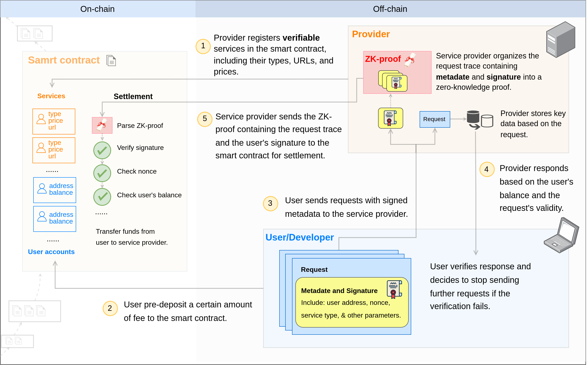

# 0G Serving Network v0.1

## Objectives

The goal of the 0G Serving Network is to connect service providers (providers) with service users (customers). Providers can offer various AI services, such as LLM inference, model, and dataset downloads, while customers can utilize these services in three forms: as users, developers, or architects.

### For Providers

1. Provide an easy way to integrate into the Serving Network.
2. Offer a flexible settlement system.

### For Customers

1. Provide different levels of access to services:
   - **Customer as User**: Direct usage of AI services through a Retail UI.
   - **Customer as Developer**: Access via OpenAI-compatible, high-availability API interfaces through a router server.
   - **Customer as Architect**: Integrate provider services into custom applications using an SDK.
2. Provide service verification to ensure validity and reliability.

## Terminology

- **Provider**: Service provider.
- **Retail UI**: Interface offered to users for direct service use, like chat and model downloads.
- **Router**: 0G server acting as an intermediary for providers.
- **Customer**: General term for service users.
  - **User**: Customer interacting with the system through the Retail UI.
  - **Developer**: Customer interacting with the system via the API and **0G Router**.
  - **Architect**: Customer interacting directly with **Provider Services** using the SDK.

## Consensus Rules

### 0G Serving Account

- Customers must create an account on the 0G Serving Contract before using services, with the account identified by the combination of customer address and provider address.
- Customers need to deposit 0G tokens in advance before accessing services.
- Accounts are required to bind a key pair:
  - Customers sign requests with a private key.
  - Providers verify the validity of requests using the public key.
  - During settlements, the contract verifies the request with the public key before transferring tokens.

### 0G Serving Service

- Providers must register their services using the registration function provided by the contract. Services should include the following metadata:

  | Field Name      | Description                                                                                                                           |
  | --------------- | ------------------------------------------------------------------------------------------------------------------------------------- |
  | Name            | The name of the service. Provider address + Name forms the primary key of the service.                                                |
  | URL             | Must be a public IP address.                                                                                                          |
  | Service Type    | Types of service include:<br>Chat (Text to Text LLM inference)<br>Model Download<br>Dataset Download                                  |
  | Service Subtype | Subtype of the service:<br>Chat (e.g., llama-3.1-8B)<br>Model Download (e.g., llama-3.1-8B)<br>Dataset Download (name of the dataset) |
  | Verifiability   | Verifiability:<br>Chat (OpML, TeeML)<br>Model/Dataset Download (TO BE DECIDED)                                                        |
  | InputPrice      | Optional, indicates the price per unit of a request, e.g., in Chat scenarios, the price per token in a request.                       |
  | OutputPrice     | Optional, indicates the price per unit of a response, e.g., in Chat scenarios, the price per token in a response.                     |

### Settlement

- Communication between customer and provider occurs over HTTP, with customer-signed requests serving as settlement receipts. Providers can submit these to the contract for settlement.
- Costs are calculated by multiplying the amount by unit price, differing by service type.
- Each request charge comprises the current request cost plus the previous response cost, reducing dishonest actions.
- To mitigate risks, contents like downloads are split into smaller parts and transmitted multiple times.

### Service Verification

- LLM inference and Model/dataset download verification methods are to be decided.

## Product Architecture

Structured as a three-layer architecture to reflect different customer needs and capabilities:

### Contract Layer [For Architects]



**Features**:

- No server involvement; data is acquired from the contract.
- Architects conduct P2P communication with providers.
- Ensure contract rule compliance using [0G SDK](#0g-sdk) and [0G Provider Broker](#0g-provider-broker).

#### 0G SDK

**Functions**:

- Generate headers required for settlement.
- Verify the integrity and validity of returned data.
- Support calling contract functions for account creation and more.

**Supported Languages**:

- [TypeScript SDK for Web UI development](https://github.com/0glabs/0g-serving-user-broker)
- TypeScript SDK for Node.js development
- Python SDK

#### 0G Provider Broker

**Functions**:

- Service registration and proxying; request validation and automated settlement mechanisms.

**Usage**:

- Download the 0G Provider Broker package.
- Fill out configuration files and deploy.
- After deployment, use the appropriate script to start registration.

**Configuration File Example**:

```yaml
interval:
  forceSettlementProcessor: 86400    // Fixed frequency cycle for settlements
  settlementProcessor: 600           // Detection frequency: Check balance risk and auto-settle if needed.
servingUrl: "http://ip:port"  // Public IP address
networks:
  ethereum0g:
    url: "https://evmrpc-testnet.0g.ai"
    chainID: 16600
    privateKeys:
      - aaaaaaaaaaaaaaaaaaaaaaaaaaaaaaaaaaaaa  // 0G private key
    transactionLimit: 1000000      // Transaction gas limit
    gasEstimationBuffer: 10000     // Transaction gas buffer
service:
  name:
  url:
  serviceType:
  serviceSubtype:
  verifiability:
  inputPrice:
  outputPrice:
```

### Router Layer [For Developers]

Not Covered in v0.1

Offers an OpenAI-compatible API for resolving high-availability issues.

### Retail Layer [For Users]

Not Covered in v0.1

Provides a user-friendly interface for direct service usage.

## Inference Services

## Storage Services
