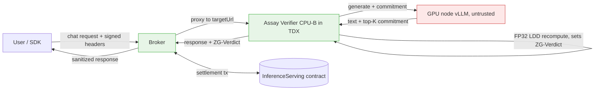
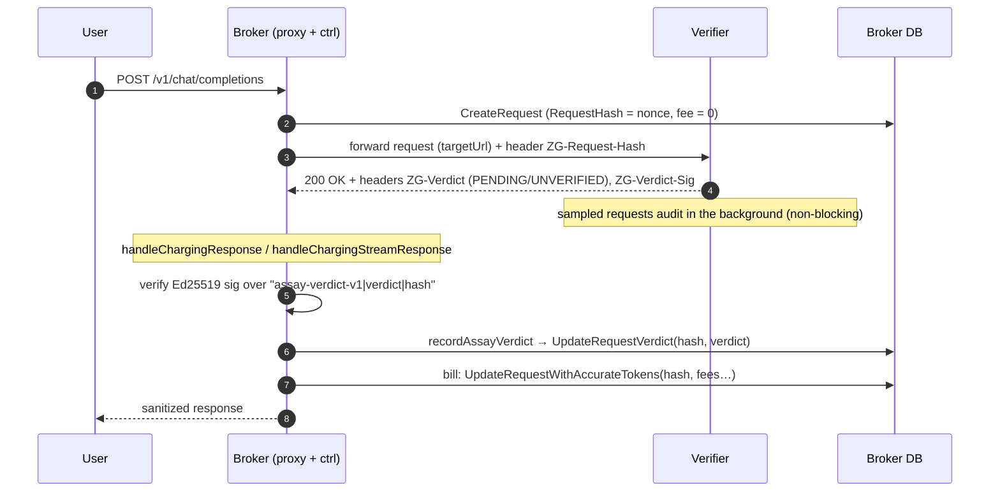
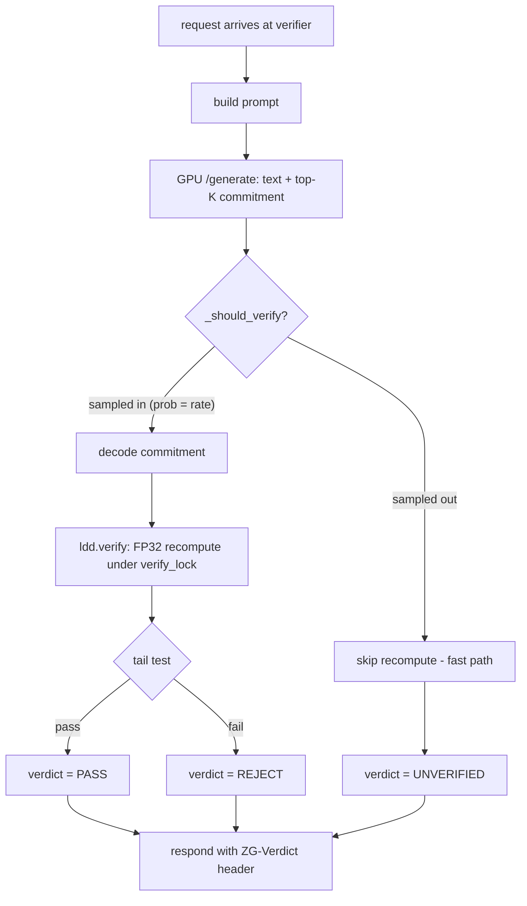
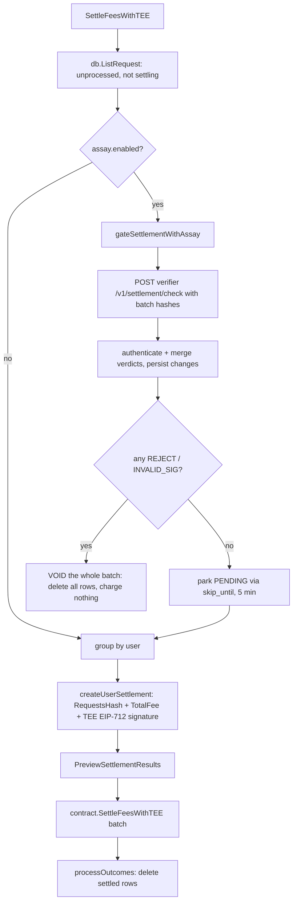

# Assay (Immaculate/LDD) Verification — Settlement Integration

This document describes how the broker integrates the **Assay verifiable-inference
verdict** into settlement, so that inferences which fail verification are not
billed to the user. It covers the trust model, the request-time and
settlement-time flows, the data model, configuration, behavior, and how to test
it.

> **Scope.** This is the "Tier-1" integration: the broker reads a per-request
> verdict the verifier already emits and excludes `REJECT`'d requests from the
> TEE-signed settlement batch. **No smart-contract change. No GPU-node change.**
> The verifier and GPU node are part of the Assay pipeline (a separate repo);
> the broker only consumes the `ZG-Verdict` response header they already produce.

---

## 1. Background

The Assay pipeline (based on the *Immaculate* paper) audits an untrusted GPU
provider by recomputing a sampled subset of inferences in FP32 and measuring the
**Logit-Distance-Distribution (LDD)** between the provider's committed logits and
the reference model. A request is judged `PASS` or `REJECT` by a tail-probability
test; sampled-out requests are `UNVERIFIED`.

The verifier node speaks the OpenAI chat-completions API and returns, per
request, a `ZG-Verdict` response header (`PASS` / `REJECT` / `UNVERIFIED`). The
broker already proxies through this verifier as its inference target. This
integration makes the broker **act on that verdict at settlement time**.

---

## 2. Topology & trust model



- **GPU node** — untrusted prover. Produces text plus a per-token top-K logit
  commitment. It is *upstream of the verdict* and never talks to the broker.
- **Verifier (CPU-B, in TDX)** — the trust root and auditor. Recomputes the
  sampled subset in FP32, decides `PASS`/`REJECT`, and sets `ZG-Verdict`.
- **Broker** — points its `targetUrl` at the verifier, records the verdict per
  request, and filters `REJECT`'d requests out of settlement.
- **Contract** — unchanged. It verifies the broker's TEE signature over
  `(RequestsHash, TotalFee, …)`; because `REJECT`'d requests are removed *before*
  signing, the fee and hash naturally cover only the verified subset.

### Known assumption: the provider audits itself (today)

In the current deployment **one operator runs all three services**: the
untrusted GPU node, the verifier that audits it, and the broker that settles.
The auditor and the audited party share an operator, so the integrity of the
whole scheme rests on the verifier actually running the published code inside
TDX — that attestation is the *only* thing separating "independent audit" from
"the provider grading its own homework". Two consequences:

- The verdict-authentication mechanism (§3) pins the verifier's signing key,
  which proves the verdict came from *that key holder* — it does not yet prove
  the key holder is an attested TDX verifier. Binding the verdict key to the
  verifier's TDX attestation (e.g. via the existing `TargetTeeAddress` /
  attestation path) is the natural next step; until then, the pubkey pin is an
  operator-managed trust anchor.
- The target end-state is a **neutral verifier tier**: verifiers operated
  independently of providers (shared/rotating, or network-operated), so the
  audit is adversarial by construction rather than by attestation alone.

Until either lands, read every guarantee in this document with that assumption
attached.

---

## 3. Request-time flow (verdict capture)

The broker captures the verdict as the response streams back, keyed by the
request's primary key (`RequestHash`). The row already exists at this point
(`CreateRequest` runs before the upstream call).



`recordAssayVerdict` is a no-op when the integration is disabled, for whitelisted
(unbilled) traffic, or when no `ZG-Verdict` header is present (**fail-open**).

**Non-blocking verdicts.** The verifier answers immediately: a sampled request
carries `ZG-Verdict: PENDING` (its LDD recompute is queued in a background
worker), an unsampled one `UNVERIFIED`. The final `PASS`/`REJECT` is fetched by
the settlement gate from the verifier's `POST /v1/settlement/check` (§5), so
clients never wait on the FP32 recompute. The verifier's legacy blocking mode
(`--sync-verify`) still puts the final verdict in the response header, and
`force_verify` traffic (dashboard samples, dataset-test overrides) always
verifies inline.

### Verdict authentication

The verdict decides settlement, so it must not remain an unauthenticated
plaintext header — otherwise whatever sits at `targetUrl` (a misconfigured
upstream, an interposed proxy, a non-TDX process posing as the verifier)
controls who gets paid. When `assay.verifierPubkey` is configured, the broker
only acts on a verdict whose `ZG-Verdict-Sig` (Ed25519, base64) verifies over

```
"assay-verdict-v1" + "|" + verdict + "|" + RequestHash
```

The broker sends `RequestHash` upstream as `ZG-Request-Hash` and the verifier
folds it into the signed payload, making every signature **single-use**: a
`PASS` captured from one response cannot be replayed onto another request, and
a `REJECT` cannot be rewritten to `PASS` without breaking the signature. The
domain prefix separates verdict signatures from the GPU node's commitment
signatures (`assay-commitment-v1`).

Two failure modes, chosen by `assay.strictVerdict`:

- **strict off (default)**: an unauthenticated verdict is *ignored* (logged;
  the request settles under fail-open). Protects revenue, but a
  header-stripping attacker can still launder a REJECT — acceptable only under
  Tier-1's detection-not-deterrence posture (§10).
- **strict on**: a missing/unverifiable verdict is recorded as `INVALID_SIG`
  and the request is **excluded from settlement** like a REJECT. Stripping the
  header now costs the request's revenue instead of laundering it.

Relevant code: [`recordAssayVerdict` / `verifyAssayVerdictSig`](../../api/inference/internal/ctrl/chatbot.go),
[`UpdateRequestVerdict`](../../api/inference/internal/db/request.go); verifier-side
signer: `_sign_verdict` in `pipeline/verifier_node/serve_verifier.py` (0g-assay
repo; key via `--verdict-key` / `$ASSAY_VERDICT_KEY`, pubkey surfaced on the
verifier's `/health` as `verdict_pubkey`).

---

## 4. When is a request verified? (randomized sampling)

Verification is decided **per request, inline and synchronously, inside the
verifier** — not by the broker, and (in the current implementation) not deferred
to settlement. The broker never samples; it only reads whatever `ZG-Verdict`
comes back.

For every request the verifier always **generates** (it needs the text and the
commitment). It then samples whether to pay for the expensive part — the **FP32
LDD recompute**:



- **Sampled in** → slow path: FP32 recompute. Because the reference fork uses a
  process-global verification log, these run serialized behind a lock.
- **Sampled out** → fast path: the commitment is not even decoded; the response
  returns as soon as the GPU finishes. **This latency gap is the point of
  sampling.**
- The verdict is available in the response header immediately, which is what
  makes the broker's inline capture (§3) possible.

### Sampling strategies

Controlled by two verifier settings, `ASSAY_VERIFY_SAMPLE_RATE` (0..1) and
`ASSAY_SAMPLE_STRATEGY`:

| `rate`        | behavior                                              |
|---------------|------------------------------------------------------|
| `>= 1.0`      | verify every request (default in the demo config)    |
| `<= 0.0`      | verify nothing                                        |
| `0 < rate < 1`| sample per `ASSAY_SAMPLE_STRATEGY` below              |

| Strategy        | Rule                                              | Use |
|-----------------|---------------------------------------------------|-----|
| `random` (default) | independent coin flip `rand() < rate` per request | **Production.** Unpredictable to the provider — the paper *requires* audit selection be indistinguishable, else a provider could cheat only on requests it knows are unaudited. |
| `deterministic` | accumulator: `acc += rate`, fire when `acc >= 1.0` (exact 1-in-N stride) | **Load-test only.** Predictable, so unsafe in production; exists to make the sampled fraction easy to verify. (Note: float accumulation makes `0.1` fire slightly late — see the verifier docstring.) |

### Why a small sample suffices (N vs α)

To detect a provider cheating on an `α` fraction of requests, with per-request
detection rate `p`, at confidence `η` (evasion probability), the number of
audited queries is

```
N = log(η) / log(1 - α·p)
```

`N` depends only on `α` and `η` — **not on total traffic volume**. E.g. α=0.1,
p=1%, η=5% → N ≈ 3,000 audited queries for 95% overall detection. So even at
billions of requests/day, a small fixed `rate` over enough traffic catches a
cheater with high probability, and the proving cost amortizes to negligible.
This is the "randomized auditing reduces proving cost" result.

### Inline vs asynchronous sampling

| | **Inline (`--sync-verify`)** | **Asynchronous (default)** |
|---|---|---|
| When recompute runs | during the request | right after the response, in a background worker |
| Hot-path latency | sampled requests pay FP32 cost | none — every response returns at GPU speed |
| Verdict availability | immediately, in `ZG-Verdict` header | header says `PENDING`; final verdict via `POST /v1/settlement/check` |
| Extra needs | none | in-memory verdict store keyed by `ZG-Request-Hash` + the settlement check (§5) |

The sampling math is identical either way; the only difference is **when** the
recompute cost is paid and where the final verdict is read. The async mode is
what makes verification invisible to client latency; the settlement gate (§5)
is what makes it still bite at billing time.

---

## 5. Settlement-time flow (verdict enforcement)

Settlement is already batch-based. The addition is a **gate** immediately after
the unprocessed requests are listed and before they are grouped into a
TEE-signed batch: the broker asks the verifier once for the batch's final
verdicts (resolving the `PENDING` ones from the async audit path), then
decides whether the batch settles at all.



Decision rule (per settlement batch):

- **cheating detected** (any `REJECT`, or strict-mode `INVALID_SIG`) → the
  **entire batch is voided**: every request in it is deleted unsettled and
  nothing is charged this cycle. The verifier retains the per-request /
  per-node audit records; the broker logs the flagged hashes as evidence.
- **audits still pending** → those requests are parked with a short
  `skip_until` (`AssayPendingRetryDelay`, 5 min) and re-gated on a later
  cycle; the rest of the batch settles normally.
- **otherwise** (`PASS` / `UNVERIFIED` / no verdict) → settle normally
  (fail-open).

The settlement-check results are authenticated exactly like the header path:
each final verdict carries an Ed25519 signature over
`"assay-verdict-v1|verdict|hash"` and is only acted on if it verifies against
`assay.verifierPubkey`. `PENDING`/`UNKNOWN` are transient, arrive unsigned,
and can only defer — never decide — payment. If the verifier is unreachable
the gate falls back to the header-recorded verdicts.

Relevant code:
[`gateSettlementWithAssay` / `resolveAssayVerdicts` / `partitionAssayRequests`](../../api/inference/internal/ctrl/settlement_assay.go);
verifier-side: `settlement_check` in `pipeline/verifier_node/serve_verifier.py`
(0g-assay repo).

---

## 6. Data model

A single nullable column is added to `request`:

| Column   | Type           | Meaning                                              |
|----------|----------------|------------------------------------------------------|
| `verdict`| `varchar(16)`  | `PASS` / `REJECT` / `UNVERIFIED` / `PENDING` (async audit in flight) / `INVALID_SIG` (strict mode), or `''` if unrecorded |

Migration: `add-verdict-to-request`
([migrate.go](../../api/inference/internal/db/migrate.go)). The column defaults to
`''`, so existing rows and the disabled path are unaffected.

---

## 7. Configuration & usage

The feature is **off by default**. Enable it in the inference broker config:

```yaml
# config.yaml
assay:
  enabled: true          # record ZG-Verdict and gate settlement on the verdicts
  # Verifier base URL for the pre-settlement verdict check
  # (POST {verifierUrl}/v1/settlement/check). Required to resolve PENDING
  # verdicts from the verifier's non-blocking mode; empty = decide on
  # header-recorded verdicts only (legacy synchronous verifier).
  verifierUrl: "http://verifier:8200"
  # How long (ms) the verifier may hold the settlement check waiting for
  # in-flight audits before answering. 0 = answer immediately; pending
  # requests are then parked and retried next cycle.
  settlementCheckWaitMs: 10000
  # Ed25519 pubkey (64 hex chars) the verifier signs verdicts with; read it off
  # the verifier's /health ("verdict_pubkey"). When set, a verdict is only
  # acted on if ZG-Verdict-Sig verifies (see §3, Verdict authentication).
  verifierPubkey: "c3e3…"
  # strict mode: missing/unverifiable verdict -> INVALID_SIG, excluded from
  # settlement (requires verifierPubkey). Default false (fail-open).
  strictVerdict: false
```

Wiring: `cfg.Assay.*` → `Ctrl.assayVerdictFilter` / `assayVerifierPubkey` /
`assayStrictVerdict` ([config.go](../../api/inference/config/config.go),
[ctrl.go](../../api/inference/internal/ctrl/ctrl.go)). A malformed pubkey — or
`strictVerdict` without a pubkey — panics at boot rather than silently
downgrading to trusting unauthenticated verdicts.

Prerequisite: the broker's service `targetUrl` must point at the Assay verifier
(which emits `ZG-Verdict` and, when signing is available, `ZG-Verdict-Sig`).
Pin the verifier's key with `--verdict-key` on the verifier so the pubkey
survives restarts.

### Behavior matrix

The effective verdict per request is the settlement-check result when
available, else the header-recorded one:

| verdict | sig | `enabled=false` | `enabled=true`, no pubkey | + `verifierPubkey` | + `strictVerdict` |
|--------------|-----|-----------------|---------------------------|--------------------|-------------------|
| `PASS`       | valid   | settled | settled | settled | settled |
| `UNVERIFIED` | valid   | settled | settled (fail-open) | settled (fail-open) | settled (fail-open) |
| `PENDING`    | —       | settled | parked, re-gated later | parked, re-gated later | parked, re-gated later |
| `UNKNOWN` (check only) | — | settled | settled (fail-open) | settled (fail-open) | stays parked |
| *(absent)*   | —       | settled | settled (fail-open) | settled (fail-open) | **batch voided** (`INVALID_SIG`) |
| `REJECT`     | valid   | settled | **batch voided** | **batch voided** | **batch voided** |
| any final    | bad/missing | settled | *(trusted as-is)* | ignored → settled | **batch voided** (`INVALID_SIG`) |

Fail-open is intentional in the default modes: a missing or non-`REJECT`
verdict never blocks revenue. Strict mode inverts that for unauthenticated
responses so signature stripping cannot launder a `REJECT`. "Batch voided"
means the *entire* settlement batch is discarded unsettled — cheating anywhere
in the cycle costs the provider the whole cycle's revenue, which is the
economic teeth behind sampling only a fraction of requests.

---

## 8. What is *not* changed

- **Smart contract** — untouched. `REJECT` exclusion happens before signing.
- **GPU node** — untouched. It is upstream of the verdict; the broker never
  contacts it.
- **Verifier** — emits `ZG-Verdict` as before (now `PENDING`/`UNVERIFIED` in
  its default non-blocking mode, with the final verdicts served by
  `POST /v1/settlement/check`); to support verdict authentication (§3) it
  additionally signs each verdict (`ZG-Verdict-Sig`) with the key from
  `--verdict-key`. An older verifier without signing still works in the
  no-pubkey / non-strict configurations, and `--sync-verify` restores the
  fully synchronous header-only flow.
- **Existing settlement paths** — inert when `assay.enabled=false`.

---

## 9. Testing

### 9.1 Unit tests (no infrastructure)

```bash
cd api
go test ./inference/internal/ctrl/ -run 'Assay|Rejected|Verdict' -v
```

Covers ([settlement_assay_test.go](../../api/inference/internal/ctrl/settlement_assay_test.go)):

- `TestPartitionAssayRequests` — `REJECT`/`INVALID_SIG` ⇒ cheat, `PENDING` ⇒
  pending, `PASS`/`UNVERIFIED`/empty ⇒ settleable, order preserved.
- `TestGateSettlementWithAssayDisabled` — disabled ⇒ passthrough, no DB/HTTP access.
- `TestGateSettlementWithAssayAllPass` — enabled, no rejects ⇒ keep all, no DB access.
- `TestResolveAssayVerdicts` — settlement-check merge rules: signed finals
  adopted, unsigned finals ignored (strict ⇒ `INVALID_SIG`), `PENDING`
  adopted unsigned, `UNKNOWN` downgrades a stuck `PENDING` fail-open
  (strict ⇒ stays parked), replayed signatures rejected.
- `TestVerifyAssayVerdictSig` — signature payload/replay rules (shared with
  the header path).

### 9.2 Manual end-to-end (broker + verifier + GPU)

1. Start the Assay GPU node and verifier (Assay pipeline repo):
   ```bash
   # GPU node (vLLM commitment server)
   python pipeline/gpu_node/serve_gpu.py --model Qwen/Qwen3-0.6B --port 8100
   # Verifier (OpenAI front, emits ZG-Verdict)
   python pipeline/verifier_node/serve_verifier.py \
       --model Qwen/Qwen3-0.6B --gpu-url http://GPU_HOST:8100 --port 8200
   ```
2. Configure the broker with `assay.enabled: true` and the service
   `targetUrl: http://VERIFIER_HOST:8200/v1`. Start the broker.
3. Confirm verdict capture: send a normal chat request through the broker, then
   inspect the DB row:
   ```sql
   SELECT request_hash, fee, verdict FROM request ORDER BY created_at DESC LIMIT 5;
   ```
   You should see `verdict = 'PASS'` (or `'UNVERIFIED'` if the verifier is
   sampling). These settle normally.
4. Force a `REJECT` to prove exclusion. The verifier returns `REJECT` when the
   LDD tail exceeds threshold; to exercise the broker deterministically without a
   real cheating GPU, either:
   - point the broker at a stub upstream that returns a fixed
     `ZG-Verdict: REJECT` header alongside a valid OpenAI body, **or**
   - lower the verifier's `--tail-fraction-threshold` so benign traffic trips
     `REJECT`.
5. Send a request that yields `REJECT`, then trigger settlement (wait for the
   settlement interval or hit the settle endpoint). Verify:
   - the settlement log shows `Assay: CHEAT DETECTED … voiding the entire
     settlement batch`;
   - **no** settlement tx is executed for the cycle and **all** of the batch's
     rows are deleted unsettled (nothing charged);
   - on a later cycle with only `PASS`/`UNVERIFIED` rows, settlement executes
     and deletes them as usual.

### 9.3 Quick header check

The verifier sets the header on every response; confirm with curl directly
against the verifier:

```bash
curl -si http://VERIFIER_HOST:8200/v1/chat/completions \
  -H 'Content-Type: application/json' \
  -d '{"messages":[{"role":"user","content":"hi"}],"max_tokens":8}' | grep -i zg-verdict
# -> ZG-Verdict: PENDING   (async default; UNVERIFIED if sampled out,
#                           PASS/REJECT only with --sync-verify)
```

And the settlement check:

```bash
curl -s http://VERIFIER_HOST:8200/v1/settlement/check \
  -H 'Content-Type: application/json' \
  -d '{"request_hashes":["<hash>"],"wait_ms":5000}' | jq
# -> {"results":{"<hash>":{"verdict":"PASS","node_id":"node_0","sig":"…"}},
#     "summary":{…},"cheat_detected":false,"settle":true}
```

---

## 10. Limitations & future work

- **Economics: batch voiding is the deterrent.** With sampling at rate *r*,
  a single detected `REJECT` voids the **whole settlement batch** — the
  provider loses the entire cycle's revenue, honest requests included. A
  provider cheating on fraction *f* of its traffic is caught in a batch of
  *n* requests with probability ≈ 1 − (1 − r·f)ⁿ, which approaches 1 fast for
  realistic batch sizes, so sustained cheating forfeits ≈ all revenue rather
  than ≈ (1 − r) of it. What is still missing on-chain: penalties beyond the
  withheld batch (stake slashing, eviction, retroactive clawback) — voiding
  only removes the upside, it doesn't cost the cheater anything they had.
- **Voiding punishes the batch, not the request.** Honest users' requests in
  a voided batch are also uncharged (they got their answers free); the
  provider eats that loss. If per-user rather than per-batch granularity is
  ever wanted, change the decision rule in `gateSettlementWithAssay`.
- **Verdict store is in-memory.** A verifier restart forgets PENDING audits;
  the settlement check answers `UNKNOWN` and the broker fails open
  (non-strict) for those requests. Persisting the verdict store is future
  work if that window matters.
- **Sampling.** With verifier sampling enabled, most requests return
  `UNVERIFIED` and settle under fail-open. This matches the paper's randomized
  auditing: detection probability depends on the cheating fraction, not on
  verifying every request. See §4 for the timing, strategies, and the N-vs-α
  argument.
- **Tier-2 (deferred batch audit) — now largely built.** The broker forwards
  `RequestHash` upstream and calls the batch `/v1/settlement/check` at
  settlement time; the verifier audits asynchronously after responding. What
  remains of the original Tier-2 idea is persisting commitments so audits can
  be re-run (or deferred entirely) instead of the audit racing the settlement
  cycle in memory.
- **Node attribution & penalties.** Attributing a `REJECT` to a specific GPU
  node (for routing de-weighting or stake slashing) is a verifier-side concern
  and does not change the broker settlement path described here.
