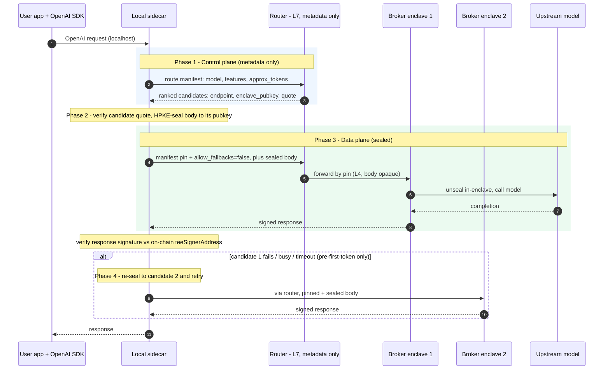

# Router End-to-End Encryption Design

This document describes how to make the **centralized / router path** end-to-end
confidential — so that the L7 aggregating router can pick a capable provider but
**cannot read the user's prompt** — without giving up the router's capability
routing and fallback.

It is an implementation design. For the *trust / verification* model (what a user
can verify, the trust chain, per-response signature verification) see the
verification walkthrough; this doc is the "how we build the sealed path" companion.

## Status

Proposed. Nothing here ships today. Today the router terminates TLS at L7 and sees
the full request (prompt included). See [Current state](#current-state).

Related: issue #552 (make centralized routing verifiable — sign the serving
domain / export the leaf cert). That issue is about *verifiability of the
destination*; this doc is about *confidentiality of the payload*. They are
complementary and share the `providerIdentity → allowed domains` trust anchor.

---

## Goals / non-goals

**Goals**
- The user's prompt (and other sensitive request fields) is unreadable to the
  router and to anything on the wire between the client and the target enclave.
- The router keeps its value: capability-based selection over a global view
  (load, price, availability) and fallback to another capable broker.
- No change to the developer surface: users keep the OpenAI SDK, only pointing
  `base_url` at a local sidecar.

**Non-goals**
- Proving the upstream *model* computed honestly (irreducible trust in the model
  provider on the centralized path — unchanged by this design).
- Hiding routing *metadata* (model name, coarse token count, capability flags).
  These stay cleartext by necessity; see [What is sealed](#what-is-sealed).
- Response-direction confidentiality beyond what the existing per-response
  signature + transport TLS already give (see [Response path](#response-path)).

**Threat model.** The router (and its host / cloud provider) is *untrusted for
confidentiality*: it may read anything it can see and log it. It is *trusted for
availability* only. The target broker enclave is trusted **only** to the extent
its attestation is verified (genuine TEE + audited measurement). The network is
assumed hostile (MITM, DNS games) — defended by sealing + attestation, not by
transport trust.

---

## Current state

```
client ──POST /v1/chat/completions (full request, plaintext)──▶ L7 router
                                                                  │ picks provider, fallback
                                                                  ▼
                                                             broker enclave ──▶ upstream model
```

- The router terminates TLS, reads the whole request, selects a capable
  provider, forwards, and fails over on error. It sees the prompt.
- The broker enclave signs a per-response routing proof
  (`api/inference/internal/ctrl/signing.go` → `signCentralizedRoutingProof`,
  served on `/v1/proxy/signature/{chatKey}`), binding
  `sha256(req):sha256(resp):providerType:providerIdentity:tlsCertFingerprint`.
- Response sanitization strips upstream-identity/cost fields and rewrites the id
  (`api/inference/internal/ctrl/sanitize.go`, #522); **signing attests the
  sanitized client-facing copy**, billing reads the raw upstream bytes.

The confidentiality gap: the prompt is plaintext at the router.

---

## The core conflict

End-to-end sealing and router-side fallback pull in opposite directions:

- **Sealing binds the payload to one specific enclave's public key**, chosen at
  encryption time.
- **Fallback re-selects the destination at runtime**, and on failure moves to a
  *different* broker with a *different* key.
- A plaintext L7 router **cannot transparently fail over a sealed blob** — doing
  so would require decrypt-then-reseal, which defeats E2E.

Therefore: *whoever seals must first pin a specific enclave, and whoever fails
over must be able to re-seal.* Two viable resolutions:

| Approach | Router sees plaintext? | E2E to final broker? | Cost |
|----------|------------------------|----------------------|------|
| **A. Sidecar owns fallback** (this design) | No — only route manifest | Yes | client does select+retry; broker publishes an encryption key |
| **B. Router runs in a TEE** (alternative) | Inside an attested enclave only | "sealed to router-enclave, re-sealed to broker" | must attest the router; plaintext transits a 2nd enclave |

This document specifies **Approach A**. Approach B is noted in
[Alternatives](#alternatives).

---

## Architecture: control plane / data plane split

The router does not stop being smart — it stops being a *plaintext decider*. Its
selection intelligence moves to a **control-plane** call over metadata only; the
**data plane** (sealed payload) is driven by the local sidecar.



- **Control plane (router, metadata-visible):** input is the route manifest;
  output is a *ranked candidate list*, each entry `{provider, endpoint,
  enclave_pubkey, quote/measurement}`. The router keeps the global-view ranking.
- **Data plane (sidecar, content-private):** the sidecar verifies the chosen
  candidate's quote, seals the body to that enclave's key, pins the destination,
  and drives the fallback loop.

The router degrades from **decider** to **candidate ranker + forwarder**. It
never sees the prompt.

---

## What is sealed

The split is by *what the routing function consumes*, not "header vs body". Route
on non-sensitive config + derived predicates; seal the actual user data.

| Field | On the wire | Why |
|-------|-------------|-----|
| `model`, `max_tokens`, `stream`, sampling params | **cleartext** (route manifest) | config knobs the router needs; not sensitive |
| `features[]`, `has_image`, `~input_tokens` | **cleartext** (derived) | capability routing needs *predicates over* the content, not the content |
| `messages`, `system`, `input`, media blobs | **sealed to enclave** | the actual user data |
| tool-call `arguments`, `user` id | **sealed to enclave** | arguments and PII stay private |

Notes:
- Derived hints are a metadata leak surface. Bucket/pad `~input_tokens` if the
  granularity is sensitive.
- The enclave must **re-validate that the cleartext manifest is consistent with
  the sealed body** after unsealing (e.g. declared `has_image` matches, token
  estimate is plausible). A mismatch → reject. This stops a tampered manifest
  from steering routing away from the real content.
- Envelope encoding must be delimiter-safe / length-prefixed (do not reuse the
  `:`-joined proof text format for structured data).

---

## Pin & fallback

"Pin" = the destination is fully determined by the sidecar, so the router's
dynamic routing/fallback is disabled for this request. Two variants:

- **(i) Via router, manifest-pinned (smallest change, recommended first):** the
  cleartext manifest carries `pin=provider_X, allow_fallbacks=false`. The router
  reads the manifest, forwards to X, and does **not** re-route. The body is
  opaque ciphertext it cannot read. Reuses the existing ingress and the existing
  pin / `allow_fallbacks` concept.
- **(ii) Direct to broker:** the sidecar connects straight to the chosen
  broker's endpoint; the router is out of the data path entirely.

**Fallback loop lives in the sidecar.** On failure/busy/timeout for candidate
#1, the sidecar seals to #2's key and retries. This is why sealing forces the
retry loop client-side: you cannot fail over an opaque blob at a plaintext
router.

**Streaming caveat:** fallback is only possible **before the first token**. Once
a stream has started emitting, a half-consumed response cannot be transparently
retried on another broker. This is inherent, not sidecar-specific.

---

## Encryption key lifecycle

The broker must publish an **encryption public key** (X25519 for HPKE), distinct
in role from the existing ECDSA **signing** key
(`api/common/tee/tee.go` → `SyncQuote`, where `report_data = signer address`
today). The encryption pubkey must be bound into the attestation the same way.

The raw key does not mathematically expire, but treat it as having a lifetime:

1. **Bind to the quote.** Publish the encryption pubkey in the quote's
   `report_data` (alongside, or committed together with, the signer address).
   A verifier trusts the pubkey only via the verified quote.
2. **Freshness is driven by attestation policy, not key math.** Verifiers reject
   quotes older than a window (cf. the 24h attestation-freshness pattern in
   `CLAUDE.md`). So even an unchanged key must be **re-attested / re-published
   periodically** or clients will stop accepting it.
3. **Rotate on measurement change.** Derive the key so a new (audited) image →
   new key. This forces clients to re-verify against the new version and
   prevents a superseded image's key from carrying over. dstack `DeriveKey`
   (`api/common/tee/phala.go`) derivation should include the app measurement.
4. **Sidecar caches `(measurement → pubkey, quote)` with a TTL** shorter than the
   quote-freshness window. Re-fetch + re-verify on expiry, on seal failure, and
   on measurement change. The control-plane candidate list should carry the
   current quote so the sidecar can verify freshness in-line.
5. **Forward secrecy (optional, heavier).** Using the long-lived enclave key
   directly as the HPKE recipient gives no PFS: extraction of that key (TEE is
   supposed to prevent this; defense in depth) would expose past sealed traffic.
   For PFS, use the long-lived attested key only to *authenticate a per-session
   ephemeral key*.

---

## Response path

Unchanged in principle:
- The broker signs the response (`signChatWithKey` /
  `signCentralizedRoutingProof`); the sidecar verifies the signature against the
  on-chain `teeSignerAddress` (the per-response verification flow).
- Sealing in this design is **request-direction**. The response already travels
  over TLS; once the L7 router is bypassed (variant ii) or reduced to L4/manifest
  forwarding (variant i), no plaintext-L7 hop reads it.
- If response-direction confidentiality from the transport is also required, the
  broker can seal the response to a client-supplied ephemeral key. Deferred —
  the signature already gives integrity + origin.

Note the sanitize interaction (#522): signing attests the **sanitized
client-facing** bytes; the sidecar must verify against exactly the bytes it
receives (see the manual verification flow, step "content binding").

---

## Local sidecar & SDK compatibility

All of the above lives behind the **local sidecar** (Option A), which speaks the
OpenAI API on `localhost`. User code is unchanged except `base_url`. The sidecar
concentrates: control-plane call, quote verification, sealing, pin, fallback
loop, response-signature verification, and key cache.

This also resolves the browser limitation: a pure browser cannot verify RA-TLS
or do these steps against the raw TLS layer; a local sidecar (or native client)
can. Browser-only clients would instead use the app-layer sealed channel (a
JS/WASM SDK) — see [Deployment modes & packaging](#deployment-modes--packaging).

---

## Deployment modes & packaging

There is one **client core** — verify quote → HPKE-seal → pin → fallback →
verify response signature → key cache. *Packaging* (how it is consumed) is
independent from *trust* (who runs it, and whether it must be attested).

### Trust boundary by location

The core touches plaintext (it holds the request before sealing), so **where it
runs determines the trust boundary — not just the deployment target.**

| | Local sidecar | Cloud-TEE gateway |
|---|---|---|
| New trust party | none | one (must be attested) |
| Plaintext lands on | the user's own machine | 0G's TEE (in-enclave) |
| Attestation of the client component | not needed (user owns it) | required (else it degrades to today's plaintext L7 router) |
| Routing / fallback | driven locally | centralized in the gateway (decrypt + re-seal) — this is Approach B |
| Best for | clients that can run software; max privacy | clients that cannot (browser / thin / no-install) |

**A cloud gateway does not remove client-side crypto.** The user→gateway hop
still needs securing (RA-TLS or app-layer seal to the gateway), so the client
must still verify the gateway's quote and seal to it. If the client can do that,
it could seal to the broker directly — so the gateway's only added value is
centralizing routing + fallback, or serving clients that cannot run a sidecar.
Trusting the gateway *without* attestation reduces it to today's plaintext L7
router (no privacy). There is no free lunch: cloud privacy requires attesting the
cloud component.

### Packaging forms (one core, several shells)

- **In-process SDK (library):** imported into the app; `create()` verifies +
  seals inline. Lowest latency, no extra process. Cost: per-language
  maintenance; pulls crypto deps (HPKE, quote verification, ethers) into the
  app; browser needs a dedicated JS/WASM build.
- **Local sidecar (process):** the core wrapped as a localhost OpenAI-API
  proxy; user changes only `base_url`. Written once, serves any user language;
  keeps crypto out of the app. Cost: a running process + one localhost hop.
- **Cloud-TEE gateway (server in a CVM):** the same core wrapped as a server,
  run in an attested enclave (Approach B). Serves no-install / browser clients;
  adds one attested trust party.

The sidecar and the gateway are the *same core wrapped as a server*; the
in-process SDK is that core *without* the server shell.

### Language plan: Go first

1. **Reuse the broker's Go code.** The core shares logic with the broker:
   ECDSA sign/recover (`go-ethereum/crypto`, already used in `signing.go`), TDX
   quote handling (`go-tdx-guest`, dstack client), and shared types
   (`ChatSignature`). One language, byte-for-byte consistency with the broker.
2. **The sidecar binary and the cloud gateway are both server-side Go
   processes** — single static binary, containerized, runs in the same
   Phala/dstack CVM the broker targets.
3. **Shipping the sidecar form covers every non-browser language on day one**
   via `base_url` (Python/TS/… keep their OpenAI SDK). No per-language
   libraries required initially.

**Known gap — the browser needs TS/WASM, and Go does not cover it well.** The
app-layer sealed channel for pure browsers needs in-browser quote verification +
HPKE. Go→WASM for a browser crypto/network library is awkward (bundle size,
WebCrypto/fetch interop), so plan a **focused TS build of just verify + seal**
for the browser segment — kept in lockstep with a written wire spec (envelope +
proof format) so it matches the Go core byte-for-byte.

**Recommended sequencing:** Go core → (1) sidecar binary (covers all
non-browser) + (2) same core reused as the cloud-TEE gateway → later, a TS/WASM
build for the browser segment.

---

## Migration & phasing

Backward compatible; sealed mode is opt-in ("privacy mode").

1. **Groundwork:** broker publishes an encryption pubkey in the quote; add the
   control-plane candidate endpoint on the router (metadata in → ranked list +
   quotes out). No client change yet.
2. **Sidecar seal + pin:** sidecar seals the body, sends with
   `pin, allow_fallbacks=false` (variant i); router honors the pin and forwards
   without re-routing. Fallback loop in the sidecar.
3. **Harden:** measurement-tied key rotation + TTL cache; manifest↔body
   consistency check in the enclave; optional direct-to-broker (variant ii).
4. **Legacy path stays** for users who do not opt into privacy mode (router keeps
   doing plaintext L7 routing + fallback for them).

---

## Limitations

- **Metadata still leaks:** model, coarse token count, capability flags, timing,
  sizes are visible to the router / TLS terminator. ECH + padding only if the
  router is not the decryptor.
- **Trust boundary unchanged for the model:** this hides the prompt from the
  router; it does not prove the upstream model behaved. Centralized = verifiable
  *routing/relay*, not verifiable *computation*.
- **Streaming fallback:** pre-first-token only (see above).
- **Replay:** the signed proof still lacks a server-side freshness field. Replay
  of a captured proof is defeated client-side by including a per-request nonce in
  the request body (its hash is already signed, so a stale proof fails the
  content-binding check); "cached-completion, freshly-signed" is mitigated by
  attesting that the code does not cache. A server timestamp/nonce in the signed
  text is the belt-and-suspenders fix. Tracked separately from this doc.
- **Extra round trip:** the control-plane call adds latency; amortized by caching
  candidate pubkeys/quotes by measurement.

---

## Alternatives

**B. Router in a TEE.** Keep fallback at the router by running it inside its own
attested enclave: the client seals to the router-enclave key, the router
decrypts *inside its TEE*, selects/fails over with full plaintext, and re-seals
to the chosen broker. Preserves transparent router-side fallback and keeps
plaintext only inside attested enclaves. Cost: the router must be attested and
added to the trust chain, and plaintext transits a second enclave (weaker than
"only the final broker sees it", though no non-TEE component sees it). Choose B
if moving the fallback loop into the sidecar is undesirable.

**Live fingerprint pinning (rejected as primary).** See #552: fragile under cert
rotation and CDN multi-cert fronting; only an optional secondary check.

---

## Affected code

- `api/common/tee/tee.go` — `SyncQuote`: publish an encryption pubkey; bind it in
  `report_data`.
- `api/common/tee/phala.go` (and `gcp.go`, `alicloud/`) — key derivation
  (measurement-tied), encryption-key material.
- `api/inference/internal/ctrl/signing.go` — response-signature path unchanged;
  see #552 for domain/cert changes to the proof.
- `api/inference/internal/ctrl/sanitize.go` — unchanged; note the "signing
  attests the sanitized copy" contract for the sidecar verifier.
- Broker request handler — accept a sealed body; unseal in-enclave; validate
  manifest↔body consistency.
- Router (`api/inference/integration/router/`) — add the control-plane candidate
  endpoint; honor `pin` / `allow_fallbacks=false`; forward the sealed body
  opaquely.
- New: local sidecar (OpenAI-compatible localhost proxy) — the client-side home
  for select/verify/seal/pin/fallback/verify-response and the key cache.

---

## Open questions

- Does the sidecar fetch candidate quotes from the router's candidate response,
  or independently from each broker's `/quote`? (Latency vs. trust-source
  independence.)
- One key (sign+encrypt) vs. two? Two is cleaner cryptographically (distinct
  roles) but doubles the binding/rotation surface.
- Response-direction sealing: needed, or is signature + TLS sufficient for the
  target users?
- Candidate-list freshness/caching policy and how it interacts with the router's
  live load view.
